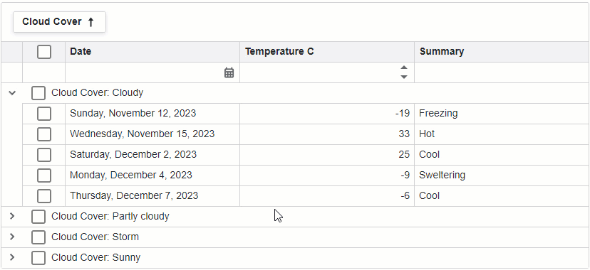

<!-- default badges list -->

<!-- default badges end -->
# Grid for Blazor - How to allow users to select and deselect all rows in a group

This example demonstrates how to configure the [DevExpress Blazor Grid](https://docs.devexpress.com/Blazor/403143/grid) component to allow users to select and deselect all rows in a group.

## Specifics and Limitations

The technique shown in the example imposes the following specifics and limitations:

* We do not recommend that you use the technique when the Grid is bound to a large data collection.
* To support scenarios when data editing  is enabled, the example implements the `InvalidateGroupDataItemsCache` method that clears cached data. Call the method in the [EditModelSaving](https://docs.devexpress.com/Blazor/DevExpress.Blazor.DxGrid.EditModelSaving) and [DataItemDeleting](https://docs.devexpress.com/Blazor/DevExpress.Blazor.DxGrid.DataItemDeleting) event handlers after you save changes to the data source.

## Overview

The Grid does not include built-in API to get rows that belong to a group. To get data items that correspond to a group's rows, the example does the following:

1. Obtains a data item collection from the database bound to the Grid.
2. Calls the **System.Linq.Dynamic.Core** library's [AsQueryable](https://learn.microsoft.com/en-us/dotnet/api/system.linq.queryable.asqueryable?view=net-8.0#system-linq-queryable-asqueryable-1(system-collections-generic-ienumerable((-0)))) method to convert the collection from [IEnumerable\<T\>](https://learn.microsoft.com/en-us/dotnet/api/system.collections.generic.ienumerable-1?view=net-7.0) to [IQueryable\<T\>](https://learn.microsoft.com/en-us/dotnet/api/system.linq.iqueryable-1?view=net-8.0).
3. Creates a filter predicate based on [grouping](https://docs.devexpress.com/Blazor/403143/grid#group-data) and filter applied to the Grid. The predicate determines whether a data item belongs to the group and meets the Grid's [filter criteria](https://docs.devexpress.com/Blazor/DevExpress.Blazor.DxGrid.GetFilterCriteria).
4. Uses the [CriteriaStringToLowerConverter](./CS/Data/CriteriaStringToLowerConverter.cs) class to make the filter predicate case-insensitive. The conversion is necessary because Linq expression filtering is case-sensitive, while grid filtering is not.
5. Filters the item collection based on the filter predicate. 

To reduce the number of requests to the database, the example saves result item collection and filter predicate to the `GroupDataItems` field of the  `GroupDataItemsCache` object. Content of the field remains constant until the grouping or the filter criteria changes. To detect such a change, the object stores field names of grouped columns and the current filter criteria in its `CacheKey` field.

## Files to Review

- [Index.razor](./CS/Pages/Index.razor)
- [CriteriaStringToLowerConverter.cs](./CS/Data/CriteriaStringToLowerConverter.cs)
- [WeatherForecast.cs](/.CS/Data/WeatherForecast.cs)
- [WeatherForecastService.cs](/.CS/Data/WeatherForecastService.cs)

## Documentation

- [Filter Data](https://docs.devexpress.com/Blazor/404326/grid/filter-data/filter-data)
- [Examples](https://docs.devexpress.com/Blazor/404035/grid/examples)

## More Examples

- [Grid for Blazor - How to implement a date range filter](https://github.com/DevExpress-Examples/blazor-dxgrid-date-range-filter)
- [Grid for Blazor - Incorporate a selector for filter row operator type](https://github.com/DevExpress-Examples/blazor-dxgrid-filter-operator-selector)
